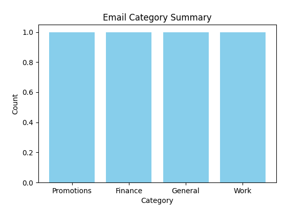

# MailMind AI

AI-powered inbox co-pilot for intelligent email prioritization, sentiment analysis, workflow automation, and actionable decision support.

## Live Demo
https://mailmind-ai.streamlit.app

## Key Features
- AI-driven inbox prioritization
- Sentiment analysis
- Reward-based decision scoring
- Workflow visualization
- Priority inbox insights
- AI-generated recommendations
- Risk-focused email analysis

## Table of contents
- Features
- Screenshots
- Architecture
- Getting Started
- Tech Stack
- Contributing

---

## Features

- Action classification (priority / reply / review)
- Sentiment analysis and visual trends
- Priority Inbox and urgent message highlighting
- AI-suggested replies and decision logging
- Interactive Plotly charts and metrics
- Gmail inbox loader (OAuth flow)

---

## Screenshots

Overview dashboard:



Priority inbox and message cards:


Hidden / sample data preview:


---

## Architecture

High-level components and data flow:

```mermaid
graph LR
	U[User] --> S[Streamlit UI]
	S --> A[App Controller]
	A --> C[classifier.py]
	A --> Sent[sentiment.py]
	A --> G[gmail_reader.py]
	A --> R[reply_generator.py]
	C --> HF[HuggingFace models (lazy-load)]
	G --> GoogleAPI[Google Gmail API]
	A --> Data[data/*.json]
```

Notes:
- Models are lazy-loaded at first use to avoid startup memory issues on Windows; small heuristics are provided as fallbacks.
- Gmail integration requires `credentials.json` (OAuth) placed in the project root; `token.json` will be generated on first auth.

---

## Getting Started

1. Create a Python environment (recommended):

```bash
python -m venv .venv
source .venv/Scripts/activate   # Windows: .venv\\Scripts\\activate
pip install -r requirements.txt
```

2. Run the dashboard:

```bash
streamlit run main.py
```

3. (Optional) To enable Gmail loader, add `credentials.json` to the project root and follow the on-screen OAuth prompt.

---

## Tech Stack

- Python 3.11+
- Streamlit
- Plotly / Matplotlib (visuals)
- Transformers (optional; lazy-loaded)
- Google API client (optional for Gmail)

---

## Contributing

PRs welcome — open an issue or a pull request with suggested changes. For code style, run `black` and keep changes focused.

---

## Author

Sankalp Pingalwad


